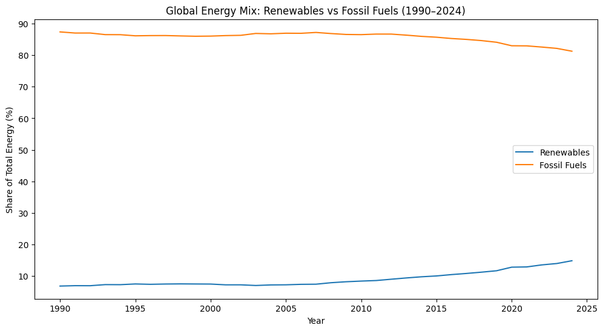
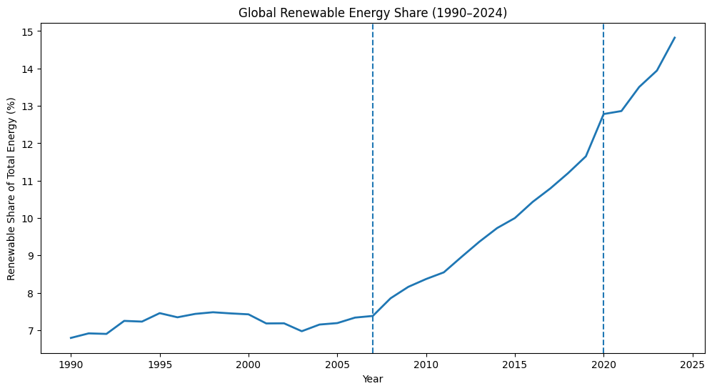
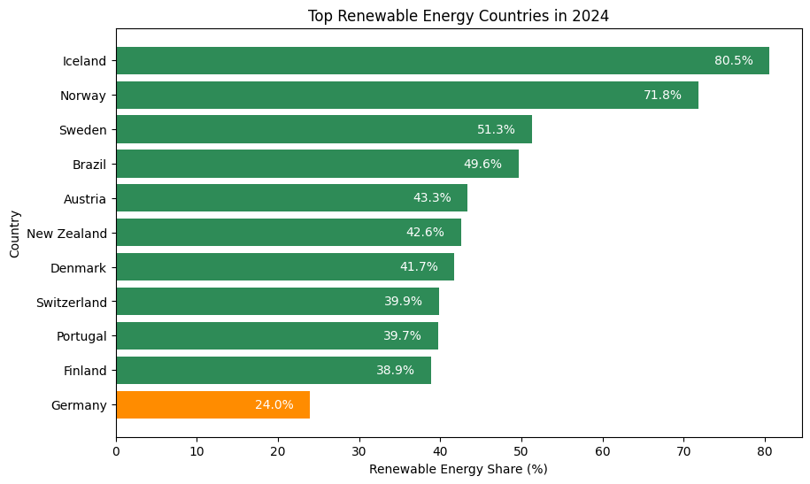
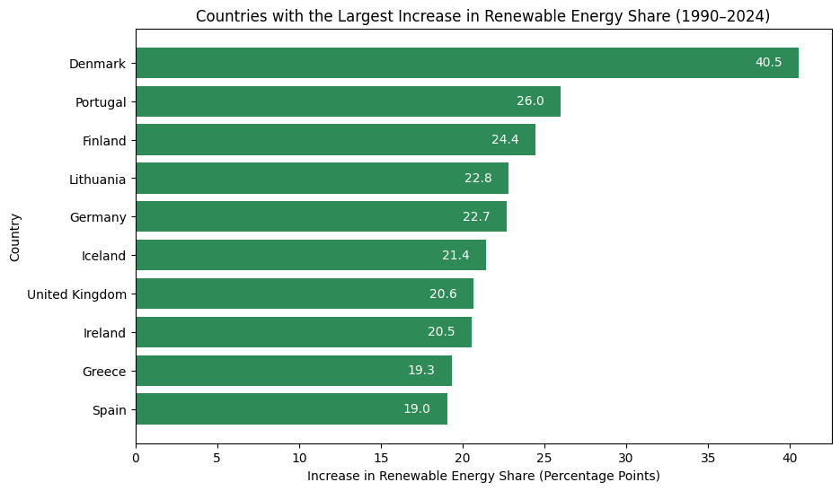
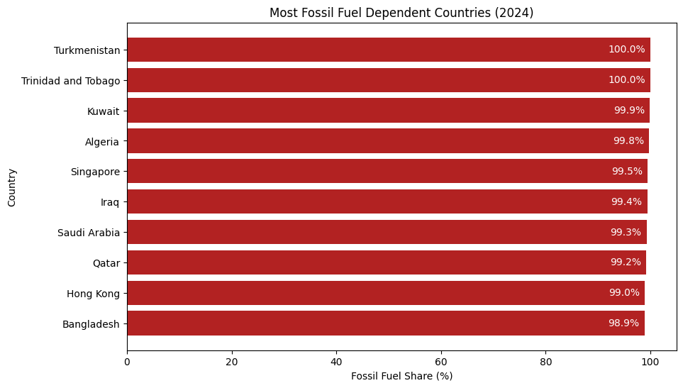
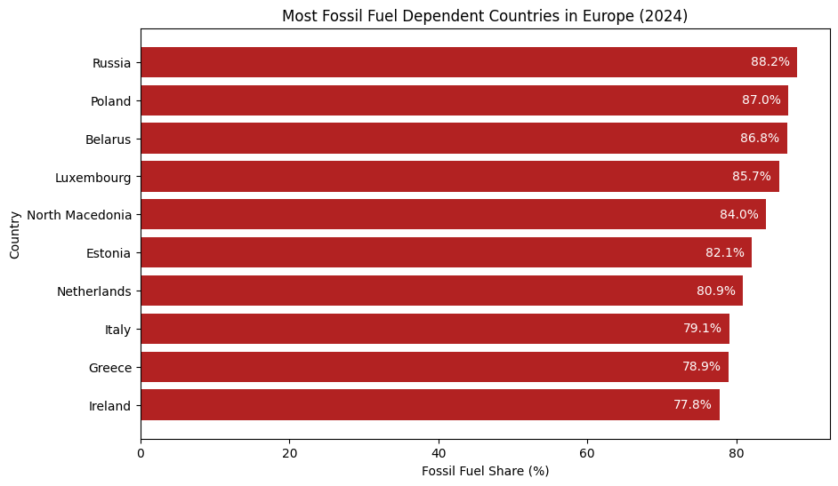
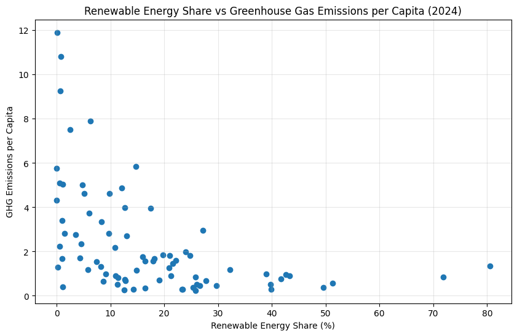
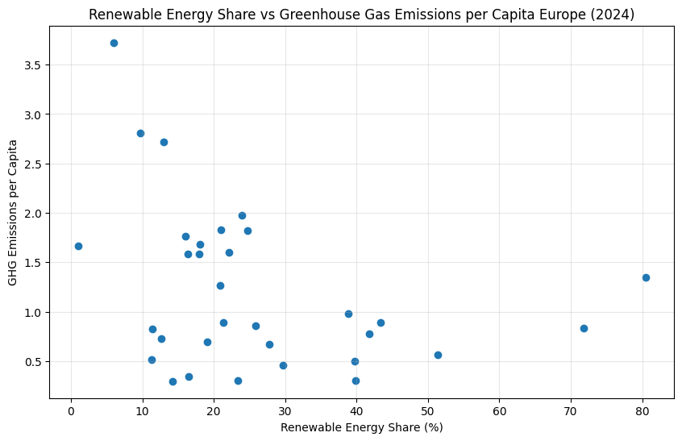

# Global Energy Transition Analysis

## Project Overview

This project explores the global energy transition using the Our World in Data (OWID) Energy Dataset.

The analysis investigates how renewable energy adoption has evolved between 1990 and 2024, identifies countries leading the energy transition, examines fossil fuel dependence, and explores the relationship between renewable energy share and greenhouse gas emissions.

The project was completed using Python, Pandas, and Matplotlib.

---

## Research Questions

1. How has the global share of renewable energy developed over time?
2. Which countries are leading the energy transition?
3. Which countries remain highly dependent on fossil fuels?
4. Is there a relationship between renewable energy share and greenhouse gas emissions per capita?

---

## Dataset

**Source:** Our World in Data (OWID) Energy Dataset

Key variables used in this analysis:

* Renewable energy share
* Fossil fuel share
* Greenhouse gas emissions
* Population
* Country
* Year

---

## Tools and Libraries

* Python
* Pandas
* Matplotlib
* Country Converter (country_converter)
* Jupyter Notebook

---

## Visualizations

### Global Energy Mix (1990–2024)



### Global Renewable Energy Growth



### Countries with the Highest Renewable Energy Share (2024)



### Countries with the Largest Increase in Renewable Energy Share Since 1990



### Most Fossil Fuel Dependent Countries (2024)



### Most Fossil Fuel Dependent Countries in Europe (2024)



### Renewable Energy Share vs Greenhouse Gas Emissions



### Europe: Renewable Energy Share vs Greenhouse Gas Emissions



---

## Key Findings

### Renewable Energy Growth

* The global share of renewable energy increased from 6.8% in 1990 to 14.8% in 2024.
* Growth accelerated noticeably after 2008.
* Despite this progress, fossil fuels continue to dominate the global energy mix.

### Renewable Energy Leaders

* Iceland leads the world with a renewable energy share of 80.5%.
* Norway and Sweden rank second and third globally.
* Germany ranks 21st worldwide but remains well above the global median.

### Renewable Energy Progress Since 1990

* Denmark achieved the largest increase in renewable energy share (+40.5 percentage points).
* Germany ranks fifth globally with an increase of +22.7 percentage points.
* The countries with the highest renewable energy shares are not necessarily the countries that improved the most.

### Fossil Fuel Dependence

* Several oil- and gas-producing countries remain almost entirely dependent on fossil fuels.
* Russia has the highest fossil fuel dependence in Europe.
* Germany continues to rely heavily on fossil energy sources.

### Emissions and Renewable Energy

* A moderate negative correlation (-0.467) exists between renewable energy share and greenhouse gas emissions per capita.
* Countries with higher renewable energy shares generally tend to have lower emissions.
* Within Europe, the relationship is weaker (-0.336), indicating that additional factors influence emission levels.

---

## Repository Structure

```text
global-energy-transition-analysis
│
├── README.md
│
├── notebooks
│   └── energy_transition_analysis.ipynb
│
├── data
│   └── owid_energy_data.csv
│
└── visuals
    ├── 1_global_energy_mix.png
    ├── 2_global_renewable_energy_share.png
    ├── 3_top_renewable_energy_countries_2024.png
    ├── 4_countries_largest_increase_renewable_energy.png
    ├── 5_most_fossil_fuel_2024.png
    ├── 6_most_fossil_fuel_europe_2024.png
    ├── 7_renewable_share_energy_ghg_emissions.png
    └── 8_renewable_share_energy_ghg_emissions_europe.png
```

---

## Conclusion

The analysis demonstrates that renewable energy adoption has increased substantially over the past three decades. However, fossil fuels remain the dominant source of energy globally.

Countries with higher renewable energy shares generally exhibit lower greenhouse gas emissions, although renewable energy alone does not fully explain emission levels. Additional factors such as industrial structure, transportation, energy efficiency, and economic activity also influence national emissions.

Overall, the results suggest that the global energy transition is progressing, but the shift away from fossil fuels remains incomplete.
